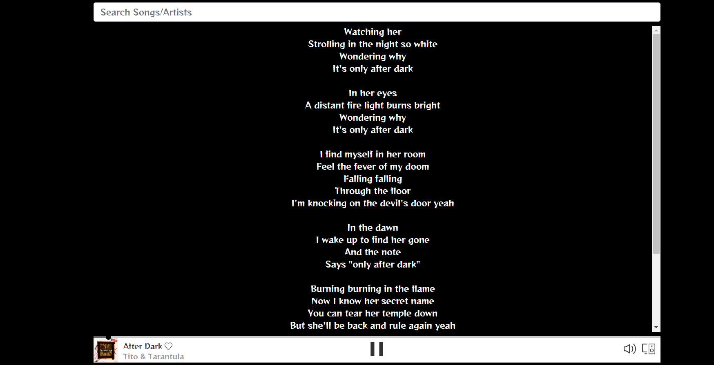

# spotify-react-app

I did this cool React app because I wanted to practice my React and Javascript skills. I also wanted to make a music player and I tried it before with the Apple Music api but it wasn't very developer friendly. I remember using the Spotify API with a node project I did during my bootcamp and I remembered how user friendly it was. So I decided to use the Spotify api. In order to use the app, the user must have a premium Spotify subscription. That's one of th rules established by Spotify, I have nothing to do with that.

# Environment Setup

1. Clone my repo at https://github.com/davidmstanleyjr/spotify-react-app

2. CD into it and type "npm install" to install all of the dependencies.

3. Then type "npm start" to run it locally.

# Technologies Used 

1. React
2. CSS
3. Javascript
4. Node
5. express
6. Spotify web API
7. Lyrics Finder
8. React Spotify web playback

# Issues

This project was not without it's challenges. I had to use 2 api keys from Spotify and one of them kept expiring within an hour. So I had to search the internet for a way to make it stop doing that.

Also, figuring out how to get the music to play was tough. I had to spend a lot of time reading the docs. I then realized that the user needs to have a premium Spotify subscription to make it work. I

The hardest part was deploying the project. The project was set up for a development environment but not to be deployed. I kept trying to deploy but it wouldn't work and I couldn't understand why because it worked locally. I then changed all the "localhost" areas to "port 5050". I also had to change my redirect uri to the URL of the live site for everything to work. That's what I'm most proud of. I've always had trouble deploying to Heroku so I was super proud to be able to do that.

# Screenshots

# Live Page 

Here is a link to the deployed site. I hope you have fun with it.
https://davids-spotify-app.herokuapp.com/
